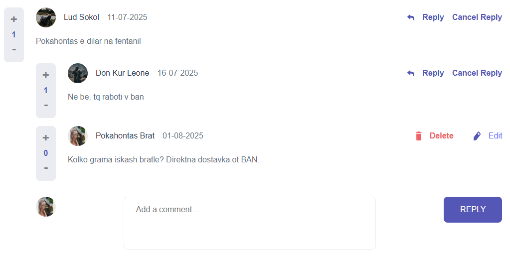

# Social Media
A social network with, called KYP (Keep Yourself Positive)

1. Main features:
    - Standard authentication and authorization.
    - Authentication and authorization with google.
    - Write, edit and delete comments and replies.
    - Like the comments and the replies.
    - View and edit the profile info.

2. Install 
    Assuming you have Python, Node.js, PostgreSQL, some IDE, working with both Python and JavaScript(for example VS Code) and a database client, like PGadmin. 
    2.1. Backend  
    - Run new terminal in the main dir AND  
    - Create new virtual environment: `py -m venv venv`
    - Activate the backend environment: `./venv/Scripts/activate`
    - Install dependencies: `pip install -r requirements.txt`
    - OR install manually each dependence from requirements.txt into your current virtual environment(not recommended)  

    2.2. Front-End  
    - Run new terminal in the frontend dir
    - Install dependencies: `npm i`

3. Setup
    Create a google client ID in the google cloud console. Make sure GOOGLE_OAUTH_CALLBACK_URL from the .env file is there.  
    3.1. Backend:  
    add the appropriate data in the .env file:
    - SECRET_KEY
    - DB_NAME
    - DB_USER
    - DB_PWD
    - DB_PORT
    - DB_HOST
    - GOOGLE_OAUTH_CLIENT_ID
    - GOOGLE_OAUTH_CLIENT_SECRET
    - GOOGLE_OAUTH_CALLBACK_URL
    - EMAIL_HOST_PASSWORD
    - EMAIL_HOST_USER

    3.2. Front-End  
    - Add VITE_GOOGLE_OAUTH_CLIENT_ID in the .env file

4. Run 

    4.1. Locally  

    4.1.1. Backend  
    - Run new terminal in the backend dir  
    - Migrate the database: `py manage.py migrate`
    - Run the backend server: `py manage.py runserver`

    4.1.2. Front-End  
    - Use the open terminal in the frontend dir
    - Run the front-end server: `npm run dev` 

    4.2. From Dockerhub

    You need just a docker-compose.yml and .env file to run the app. Here is the docker-compose.yml:
                
        version: '3.0'

            services:
            db:
                image: postgres:15
                container_name: kyp_db
                environment:
                POSTGRES_DB: ${DB_NAME}
                POSTGRES_USER: ${DB_USER}
                POSTGRES_PASSWORD: ${DB_PASSWORD}
                ports:
                - "5432:5432"

            backend:
                image: xaoccc/kyp_backend_image:latest
                container_name: kyp_backend
                depends_on:
                - db
                environment:
                DATABASE_URL: postgres://${DB_USER}:${DB_PASSWORD}@db:5432/${DB_NAME}
                ports:
                - "8000:8000"

            frontend:
                image: xaoccc/kyp_frontend_image:latest
                container_name: kyp_frontend
                depends_on:
                - backend
                ports:
                - "5173:5173"
    
 Important!!! If you have `$` in your original .env file, replace it with `$$` before running the app from dockerhub. 

5. Screenshots:

6. Contact the developer:

    If you have any problems with the app, please contact me at xaocccc@gmail.com.

    Enjoy!

